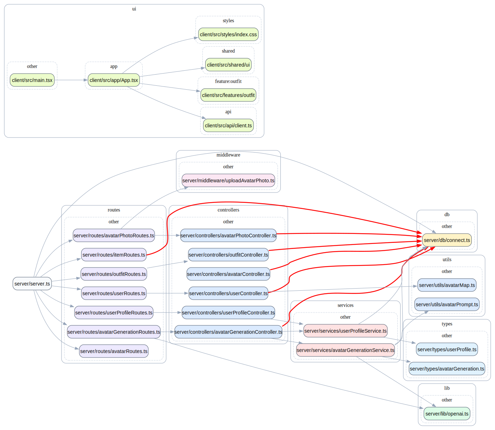

# Truss — Architecture Boundary Enforcement Tool

Truss is a configuration-driven static analysis tool that enforces architectural boundaries in JavaScript and TypeScript codebases using dependency graph analysis.

It operates on static import analysis without executing code.

It detects direct and transitive architectural violations via dependency graph analysis and provides deterministic outputs for CI pipelines and developer workflows.

---

## Quick Start

Run without installing:

```bash
npx truss-lint init
npx truss-lint check
```

Or install globally:
```bash
npm install -g truss-lint
truss-lint init
truss-lint check
```

---

## Dependency Graph Visualization

Truss can render a dependency graph of your project with layer grouping and highlighted architectural violations.



---

## How It Works

Truss performs deterministic static analysis using a dependency graph pipeline:

1. Load and validate `truss.yml`
2. Discover source files (`.ts/.tsx/.js/.jsx`, ignore junk folders)
3. Parse imports and build dependency edges
4. Assign files to layers
5. Evaluate rules
6. Apply suppressions
7. Render human or JSON output
8. Exit with status code

---

## Key Features

- Graph-based dependency analysis
- Detection of direct and transitive architectural violations via graph traversal
- Dependency cycle detection integrated into analysis diagnostics
- Layer-based architecture enforcement via configuration
- Deterministic CLI and JSON outputs
- CI integration for automated architectural checks
- Visual graph rendering with violation highlighting

---

## Usage

### 1. Install

```bash
npm install -D truss-lint
```

Or use without installing:

```bash
npx truss-lint check
```

---

## 2. Initialize configuration

Create a starter configuration file in your project:

```bash
npx truss-lint init
```
This will generate a truss.yml file in your project root.

## 3. Configure layers and rules

Edit the generated truss.yml to define your architecture:

```yaml
version: "1"

layers:
  client:
    - "client/**/*.ts"
    - "client/**/*.tsx"
  server:
    - "server/**/*.ts"

rules:
  - name: no-client-to-server
    from: client
    disallow: [server]
```

---

### 3. Run analysis

```bash
truss-lint check
```

---

### 4. Generate dependency graph

```bash
truss-lint graph > graph.dot
dot -Tsvg graph.dot -o graph.svg
```

---

## Exit Code Matrix

- `0` No unsuppressed violations  
- `1` One or more unsuppressed architectural violations  
- `2` Configuration or CLI usage error  
- `3` Internal error  

---

## Sample Output (Violation)

```text
Truss: Architectural violations found (1)

[VIOLATION] no-api-to-db
Layers: api -> db
src/api/user.ts:15
import { db } from "../db/client"
Reason: API layer must not depend directly on DB layer.

Summary:
Unsuppressed: 1
Suppressed: 0
Total: 1
```

---

## Sample Output (Success)

```text
Truss: No Architectural violations found
Checked 9000 files
```

---

## Deterministic Output

Truss guarantees stable and deterministic output across runs:

- consistent sorting of violations  
- stable JSON schema  
- snapshot-safe CLI output  

This ensures reliable CI checks and predictable developer experience.

---

## JSON Output Contract

When `--format json` is provided, Truss prints exactly one JSON object to stdout.

### Schema versioning

All JSON output includes:

- `schemaVersion`
- `kind` (`report` or `error`)

---

### Report output (`kind: "report"`)

```json
{
  "schemaVersion": "1.1.0",
  "kind": "report",
  "exitCode": 1,
  "checkedFiles": 42,
  "edges": 137,
  "unsuppressed": [],
  "suppressed": [],
  "parserIssues": [],
  "analysis": {
    "diagnostics": [],
    "categories": {
      "parser": 0,
      "graph": 0,
      "validation": 0,
      "suppression": 0
    }
  },
  "summary": {
    "unsuppressedCount": 0,
    "suppressedCount": 0,
    "parserIssueCount": 0,
    "diagnosticCount": 0,
    "totalCount": 0
  }
}
```

---

### Error output (`kind: "error"`)

```json
{
  "schemaVersion": "1.1.0",
  "kind": "error",
  "exitCode": 2,
  "error": "Failed to load truss.yml"
}
```

---

## Continuous Integration

Truss integrates with CI pipelines to enforce architectural constraints.

### Fail PR on Violations

```yaml
name: Truss
on:
  pull_request:
  push:
    branches: [main]

jobs:
  truss:
    runs-on: ubuntu-latest
    steps:
      - uses: actions/checkout@v4
      - uses: actions/setup-node@v4
        with:
          node-version: 20
      - run: npm ci
      - run: npx truss-lint check
```

---

## CLI Test Coverage

The integration suite uses fixture repos and committed snapshots to keep the CLI contract explicit.

- Snapshot tests for human and JSON output  
- Validation of exit codes (0–3)  
- Coverage of clean, violation, suppressed, and error scenarios      
      


